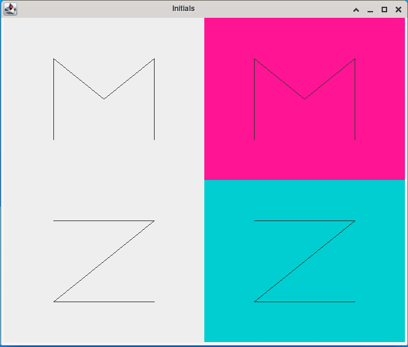

# Graphic Letters
This is a project which allows the user to display letters of the English alphabet in a graphical manner through Java

## Technologies
The programs in this project were run using the following:
* Java 11
* X11

## Setup
This project currently only has two letters (M and Z) created for the user to display. If desired, users can create new Java files to create any other letters they wish. Simply review the format of the **Letter\*.java**  files to create the new letters you would like.

After cloning or forking the repository, you can run any of the Java programs through the command line in the below manner:
1. You will want to `cd` into the repository
2. Modify the **DisplayLetters.java** file to format the letters looking to be displayed
2. Compile the **DisplayLetters.java** file
   - `javac DisplayLetters.java`
3. Run the *class* file created
   - `java DisplayLetters`

## Output

